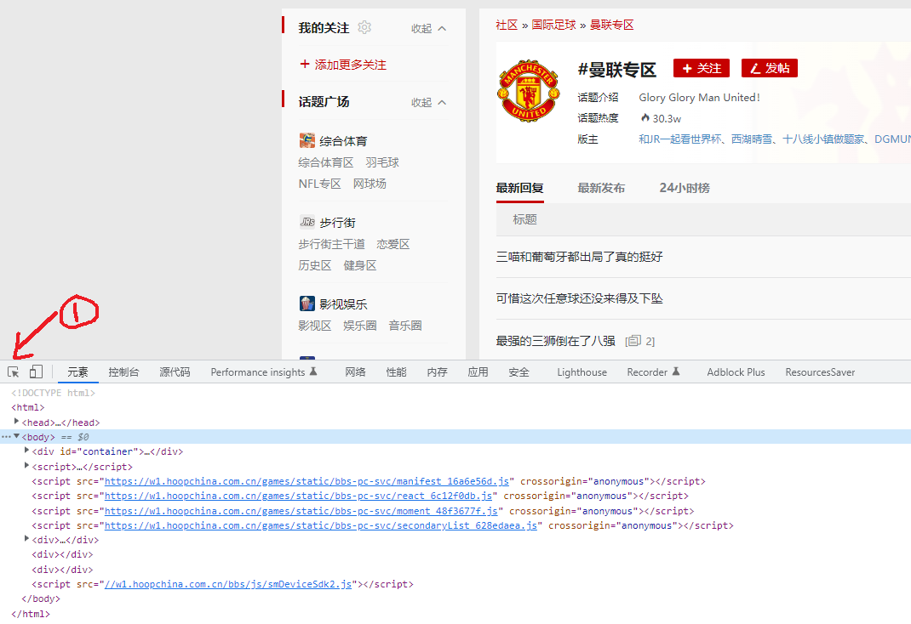

# CustomFilter使用以及简单CSS教程

此教程是给零网页知识的普通人看的，所以会比较基础。

## 简单CSS教程

先写CSS教程，只需要掌握class、id和父子选择器就可以，足够灵活使用CustonFilter这个插件。

### 控制台以及html标签

每个网页是由许多html元素组成的，所谓的html标签就是<body>、<div>等等以及内容。
  
  
  
以虎扑-曼联专区这个页面为例，在Chrome浏览器中按下F12，打开控制台，选择元素这个tab页，里面的内容就是组成页面的html标签。
    
按下了控制台左上角画线①的那个按钮，当鼠标在页面移动时，下面控制台的当前元素就会切换成鼠标所在位置的标签。
现在鼠标选择了一条帖子，下面的当前元素变成了`<div class="post-title">`, 通常有许多帖子就会有许多相同的标签，只是内容不同，再往上级看，有个
`<li class="bbs-sl-web-post-body">`,缩起来之后看到很多这个标签，在控制台按下delete删除这个标签之后，帖子也被删除，当然这个删除只是在我们本地页面的删除，
 F5刷新页面就又出来了，所以我们要屏蔽的主要标签就是这个`<li class="bbs-sl-web-post-body">`。
  
## html属性以及父子关系
比如页面中的`<a href="/56894933.html" target="_blank" class="p-title" style="color:;font-style:normal">最强的三狮倒在了八强</a>`
<a>就是标签，a标签，`<>`里面的href叫做属性，`href=`的后面叫做属性值。`<>`和`</>`的中间就是html内容。这个内容也可以是其他标签。
这样就出现父子关系了。比如
 ```
  <div class="post-title">
  <a href="/56894933.html" target="_blank" class="p-title" style="color:;font-style:normal">最强的三狮倒在了八强</a>
  <span class="page-icon">[<i class="iconfont iconfanye"></i><a href="/56894933-2.html" class="page-icon-item">2</a>]</span>
  </div>
  ```
  这里就有div标签中有两个子标签，对a标签来说，div是父标签。

### 选择器
  
选择器代表了可以选择哪些html标签的模式。
常用的选择器有class选择器和id选择器以及父子选择器
  
### 标签选择器
用标签名表示，比如div
  
#### class选择器
`<li class="bbs-sl-web-post-body">`
不同标签的class属性的属性值是可以重复的，可以通过标签的class属性来选择多个标签。用`.`(点)加class的属性值来表示。
比如`.bbs-sl-web-post-body`代表了所有class值为bbs-sl-web-post-body的标签，也就是所有帖子。
class值可以有多个，用空格分隔，比如`<li class="bbs-sl-web-post-body test">`,用`.bbs-sl-web-post-body`和`.test`都可以。

### id选择器
```
<div id="container">
    xxx
</div>
属性名为id的值对应的选择器，用`#`加属性值来表示，比如上面的`#container`，一个页面内id的值不能重复。
### 同时选择器
同时满足多个选择器的标签，多个选择器直接连起来
比如`li.bbs-sl-web-post-body`,既是li标签，class元素又包含了bbs-sl-web-post-body
## 父子选择器
   ```
  <div class="post-title">
  <a href="/56894933.html" target="_blank" class="p-title" style="color:;font-style:normal">最强的三狮倒在了八强</a>
  <span class="page-icon">[<i class="iconfont iconfanye"></i><a href="/56894933-2.html" class="page-icon-item">2</a>]</span>
  </div>
  ```
通过父子关系来更精确快速的定位，用空格表示父子关系，注意这里的父子关系包括儿子，孙子，上面div的儿子是a和span，div的孙子是span里的a和i。
比如`div .p-title`选择了div内的第一个a标签。 


主要配置4个位置

① 要应用屏蔽的页面地址

②隐藏掉的标签

③屏蔽关键词

④要搜索关键词的元素，一般情况下，Search Range和Elements to hide一样就可以，如果想提高运行效率，可以设置为Elements to hide的子标签。当在Search Range中查找到屏蔽词之后，在当前位置以及往上级找，找到Elements to hide，隐藏掉，屏蔽结束。


